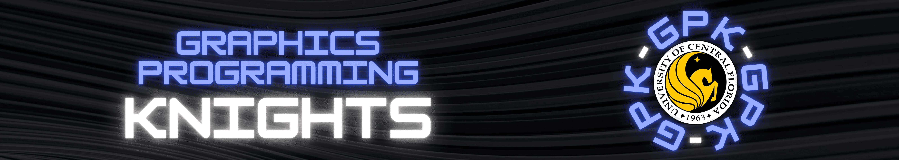

# Graphics Programming Knights Web Dev Repo

<div align="center">
  
</div>

## Team

**Lead**
- Sebastian Noel ([@sebastian-noel](https://github.com/sebastian-noel)) | GPK Dev Lead

**Admins**
- Alejandro Jaimes ([@alecocosette](https://github.com/alecocosette)) | GPK President
- Stevin George ([@stevin006](https://github.com/stevin006)) | GPK Outreach Lead

**Dev Team**
- Kevin Li ([@kevinli7673](https://github.com/kevinli7673)) | GPK Treasurer
- Zeeshan Memon ([@satasatalight](https://github.com/satasatalight))
- Nicole Bustos ([@nickycodezz](https://github.com/nickycodezz))
- Jeremy Whatts Rodriguez ([@cunkin375](https://github.com/cunkin375))
- Abigail Loken ([@Abbby1007](https://github.com/Abbby1007))
- Alvaro Canseco-Martinez ([@a1vcm](https://github.com/a1vcm))
- Ethan Fu ([@yaboi332](https://github.com/yaboi332))

Message Sebastian through [discord](https://discord.com/users/353944957779968010) if you have an interest in contributing.

## Tech Stack

- Next.js
- React Three Fiber (R3F) + Drei
- Tailwind CSS
- TypeScript
- ESLint
- Node.js (LTS)

## Quick Start

```bash
git clone https://github.com/GraphicsProgrammingKnights/gpkweb
cd gpkweb
npm install
npm run dev
```

Open <http://localhost:3000>.

For full setup details (Node version pinning, lint, build, Docker), the PR workflow, branch/commit conventions, and a command cheat sheet, see [CONTRIBUTING.md](CONTRIBUTING.md).

## Project Structure

```text
.
├── app/                   # Next.js routes
├── components/            # Reusable UI components
├── public/                # Static assets
├── styles/                # Global/component styles
├── .github/               # GitHub templates/workflows
│   └── workflows/         # CI/CD pipelines
├── Dockerfile             # Production container
├── docker-compose.yml     # Local Docker setup
├── CONTRIBUTING.md        # Contributor guide
├── tsconfig.json          # TypeScript configuration
├── package.json
└── README.md
```

## Infrastructure

GitHub Actions workflows run automatically on PRs and pushes to `main`:

| Workflow        | Trigger                                       | What it does                |
|-----------------|-----------------------------------------------|---------------------------- |
| **CI**          | PRs and pushes to `main`                      | Runs lint and build         |
| **Docker Build**| PRs/pushes affecting app code or Docker files | Verifies Docker image builds|

View workflow runs: [Actions tab](https://github.com/GraphicsProgrammingKnights/gpkweb/actions)

## Contributing

See [CONTRIBUTING.md](CONTRIBUTING.md) for the full contributor guide — setup, PR workflow, branch/commit conventions, Docker commands, and a "what to do / not to do" reference.

## License

This project is licensed under the [MIT License](LICENSE) - see the [LICENSE](LICENSE) file for details.
